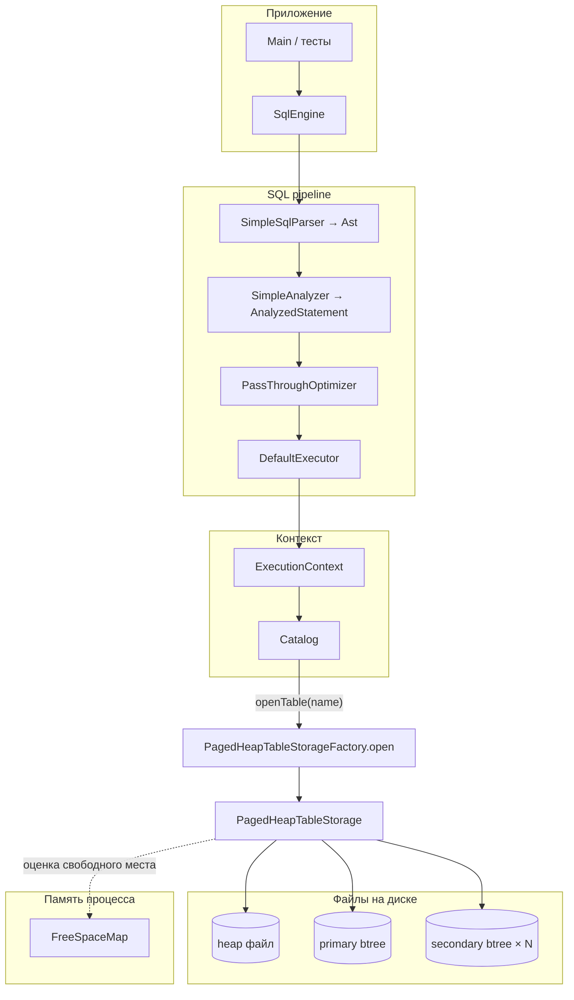

# IngeniumReltionalDB

Учебный проект: минимальная СУБД «с нуля» — каталог таблиц, постраничная куча со слотами, уникальные btree-индексы (отдельные файлы), тонкий SQL-слой поверх.

**Сборка и запуск**

```bash
./gradlew test
./gradlew run
```

Зависимости: Java, Gradle; индексы — библиотека [btree4j](https://github.com/myui/btree4j) (`io.github.myui:btree4j:0.9.1`).

---

## Общая схема системы

Два почти независимых мира на диске:

1. **Куча (heap)** — ваши страницы фиксированного размера (`PageStore` / `FilePageStore`), внутри — слоты (`SlottedPage`).
2. **Индексы** — отдельные файлы B+-дерева btree4j; в значениях лежит сериализованный `RecordId` (6 байт), а не «страница кучи».

Связка: ключ в индексе → `RecordId` → чтение tuple из кучи по `(pageId, slot)`.



---

## Поток выполнения SQL

1. **`SqlEngine.execute(sql, ctx)`** — единая точка входа.
2. **`SimpleSqlParser`** — regex, не полноценный лексер: строит `InsertAst` / `SelectAst` (`Ast`).
3. **`SimpleAnalyzer`** — привязывает AST к `AnalyzedStatement` (имя таблицы, `INSERT`/`SELECT`, для INSERT — `Row`).
4. **`PassThroughOptimizer`** — сейчас тождественное преобразование (заготовка под будущий оптимизатор).
5. **`DefaultExecutor`** — по `ExecutionContext.catalog()` открывает таблицу и вызывает `TableStorage.insert` или `TableStorage.scan`.

```mermaid
sequenceDiagram
    participant Client
    participant SqlEngine
    participant Parser as SimpleSqlParser
    participant Analyzer as SimpleAnalyzer
    participant Opt as PassThroughOptimizer
    participant Exec as DefaultExecutor
    participant Cat as Catalog
    participant TS as PagedHeapTableStorage

    Client->>SqlEngine: execute(sql, ExecutionContext)
    SqlEngine->>Parser: parse(sql)
    Parser-->>SqlEngine: Ast
    SqlEngine->>Analyzer: analyze(Ast)
    Analyzer-->>SqlEngine: AnalyzedStatement
    SqlEngine->>Opt: optimize(...)
    Opt-->>SqlEngine: AnalyzedStatement
    SqlEngine->>Exec: execute(plan, ctx)
    Exec->>Cat: openTable(tableName)
    Cat-->>Exec: TableStorage
    alt INSERT
        Exec->>TS: insert(Row)
    else SELECT
        Exec->>TS: scan()
    end
```

### Поддерживаемый SQL (строго)

| Операция | Формат |
|----------|--------|
| INSERT | `INSERT INTO <table> VALUES (<int64>, '<text>');` — второй аргумент строка в одинарных кавычках, без экранирования кроме как в regex. |
| SELECT | `SELECT * FROM <table>` (точка с запятой опциональна). |

Имя таблицы должно совпадать с зарегистрированным в `Catalog` (`TableDescriptor.id().name()`).

---

## Каталог и дескриптор таблицы

- **`Catalog`** — потокобезопасная in-memory карта `имя таблицы → TableDescriptor`.
- **`TableDescriptor`** — `TableId`, `Schema`, путь к **heap**, путь к **первичному** индексу, карта `имя вторичного индекса → путь к файлу`.

Открытие: `catalog.openTable(name)` → `PagedHeapTableStorageFactory.open(descriptor)` создаёт `FilePageStore` и все `Btree4jSecondaryIndex` по путям из дескриптора.

---

## Схема строки (`Schema`)

- Список колонок (`Column` + `ColumnType`), индекс колонки первичного ключа (сейчас только **INT64**).
- Опционально: уникальные **вторичные** индексы: имя → индекс колонки (не PK).

Утилиты: `Schema.defaultRowSchema()` — `(id PK, text)` без вторичных; `defaultRowSchemaWithTextSecondary()` — вторичный индекс `text_idx` на колонку `text`.

---

## Хранение: `PagedHeapTableStorage`

### Роль компонентов

| Компонент | Назначение |
|-----------|------------|
| `FilePageStore` | Файл кучи: страница `pageId` → смещение `[pageId × pageSize, …)`; размер страницы по умолчанию **512** байт (`PagedHeapTableStorageFactory.DEFAULT_PAGE_SIZE`). |
| `SlottedPage` | Разбор/сборка одной страницы: заголовок, tuple’ы снизу вверх от фиксированного offset, каталог слотов сверху вниз от конца страницы. |
| `FreeSpaceMap` | In-memory `pageId → availableBytes` для быстрого выбора страницы под новый tuple; при первом insert после открытия при непустом файле делается **rebuild** по всем страницам. |
| `TupleCodec` | Кодирование строки в байты по `Schema` (в т.ч. ключи для индексов). |
| `Btree4jSecondaryIndex` | Реализация `SecondaryIndex`: ключ → значение `RecordId.toBytes()`. И первичный, и вторичные индексы — этот тип (отдельные файлы). |

### Вставка строки (логика)

1. Проверка уникальности PK и всех заданных вторичных ключей по индексам.
2. Кодирование tuple, **`insertTupleOnly`**:
   - ленивая инициализация `FreeSpaceMap` (rebuild при необходимости);
   - `pickPage(tuple.length)` — страница с достаточным `SlottedPage.availableBytes`;
   - при промахе hint — полный перебор существующих страниц;
   - иначе `allocatePage`, `SlottedPage.initEmpty`, вставка;
   - после успешной записи — обновление карты для страницы.
3. Запись в PK-индекс и во все вторичные индексы пар `(key bytes → RecordId)`.

### Макет слотовой страницы (`SlottedPage`)

Страница — один `ByteBuffer` длины `pageSize`.

```
┌─────────────────────────────────────────────────────────────┐
│ Заголовок 16 B: magic, число слотов, границы свободной зоны  │
├─────────────────────────────────────────────────────────────┤
│ Tuple 0, Tuple 1, … растут от offset HEADER (16) вверх     │
├ ─ ─ ─ ─ ─ ─ ─ ─ ─ свободное пространство ─ ─ ─ ─ ─ ─ ─ ─ ─ ┤
│ … каталог слотов с конца: (u16 offset, u16 length) на слот  │
└─────────────────────────────────────────────────────────────┘
```

`RecordId` = `(pageId: int, slot: short)` — 6 байт big-endian в btree-значениях.

### Почему индекс ≠ страница кучи

Файл btree4j имеет **свой** формат страниц и не совпадает с `PageStore`. Комментарий в `storage.page` package-info это фиксирует. Единственный «мост» — сериализованный `RecordId` в значении индекса.

---

## Файлы в репозитории (ориентир)

| Область | Пакет / классы |
|---------|----------------|
| Точка входа | `org.example.Main` |
| SQL фасад | `org.example.core.exec.SqlEngine`, `DefaultExecutor` |
| Парсер / анализ | `SimpleSqlParser`, `SimpleAnalyzer`, `PassThroughOptimizer` |
| DTO | `dto.*` — `Ast`, `AnalyzedStatement`, `ExecutionResult`, `Row`, `RecordId`, `TableDescriptor`, … |
| Каталог | `catalog.Catalog` |
| Куча | `storage.impl.PagedHeapTableStorage`, `PagedHeapTableStorageFactory` |
| Страницы | `storage.page.*` — `FilePageStore`, `SlottedPage`, `FreeSpaceMap` |
| Индексы | `index.Btree4jSecondaryIndex`, `SecondaryIndex` |
| Тесты | `SqlPipelineTest`, `FreeSpaceMapTest`, индексные/хранилищные тесты в `src/test` |

---

## Краткий чеклист для расширения

- Новый синтаксис SQL → расширить `SimpleSqlParser`, AST и `SimpleAnalyzer` / `DefaultExecutor`.
- Новые типы колонок / кодировка → `TupleCodec`, `ColumnType`, проверки в `Schema`.
- Оптимизация запросов → реальная логика в `PassThroughOptimizer` и, при необходимости, новые «планы» вместо одного `AnalyzedStatement`.
