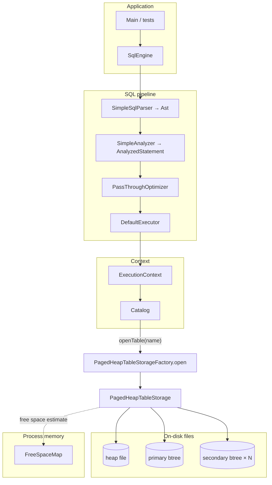

# IngeniumReltionalDB

Educational project: a minimal database engine built from scratch — table catalog, paged slotted heap, unique btree indexes (separate files), and a thin SQL layer on top.

**Build and run**

```bash
./gradlew test
./gradlew run
```

Requirements: Java, Gradle; indexes use [btree4j](https://github.com/myui/btree4j) (`io.github.myui:btree4j:0.9.1`).

---

## System overview

Two largely independent on-disk worlds:

1. **Heap** — fixed-size pages (`PageStore` / `FilePageStore`) with slot management (`SlottedPage`).
2. **Indexes** — separate btree4j B+-tree files; values store a serialized `RecordId` (6 bytes), not a “heap page” pointer.

The link: index key → `RecordId` → read the tuple from the heap at `(pageId, slot)`.



---

## SQL execution path

1. **`SqlEngine.execute(sql, ctx)`** — single entry point.
2. **`SimpleSqlParser`** — regex-based, not a full lexer: builds `InsertAst` / `SelectAst` (`Ast`).
3. **`SimpleAnalyzer`** — maps the AST to `AnalyzedStatement` (table name, `INSERT`/`SELECT`, `Row` for INSERT).
4. **`PassThroughOptimizer`** — identity for now (placeholder for a future optimizer).
5. **`DefaultExecutor`** — uses `ExecutionContext.catalog()` to open the table and calls `TableStorage.insert` or `TableStorage.scan`.

```mermaid
sequenceDiagram
    participant Client
    participant SqlEngine
    participant Parser as SimpleSqlParser
    participant Analyzer as SimpleAnalyzer
    participant Opt as PassThroughOptimizer
    participant Exec as DefaultExecutor
    participant Cat as Catalog
    participant TS as PagedHeapTableStorage

    Client->>SqlEngine: execute(sql, ExecutionContext)
    SqlEngine->>Parser: parse(sql)
    Parser-->>SqlEngine: Ast
    SqlEngine->>Analyzer: analyze(Ast)
    Analyzer-->>SqlEngine: AnalyzedStatement
    SqlEngine->>Opt: optimize(...)
    Opt-->>SqlEngine: AnalyzedStatement
    SqlEngine->>Exec: execute(plan, ctx)
    Exec->>Cat: openTable(tableName)
    Cat-->>Exec: TableStorage
    alt INSERT
        Exec->>TS: insert(Row)
    else SELECT
        Exec->>TS: scan()
    end
```

### Supported SQL (strict)

| Statement | Format |
|-------------|--------|
| INSERT | `INSERT INTO <table> VALUES (<int64>, '<text>');` — second value is a single-quoted string; escaping is only what the regex allows. |
| SELECT | `SELECT * FROM <table>` (trailing semicolon optional). |

The table name must match the one registered in `Catalog` (`TableDescriptor.id().name()`).

---

## Catalog and table descriptor

- **`Catalog`** — thread-safe in-memory map `table name → TableDescriptor`.
- **`TableDescriptor`** — `TableId`, `Schema`, path to the **heap**, path to the **primary** index, and a map `secondary index name → file path`.

Opening: `catalog.openTable(name)` → `PagedHeapTableStorageFactory.open(descriptor)` creates the `FilePageStore` and every `Btree4jSecondaryIndex` from paths in the descriptor.

---

## Row layout (`Schema`)

- Ordered columns (`Column` + `ColumnType`), primary key column index (currently **INT64** only).
- Optional unique **secondary** indexes: name → column index (not the PK).

Helpers: `Schema.defaultRowSchema()` — `(id PK, text)` with no secondaries; `defaultRowSchemaWithTextSecondary()` — secondary index `text_idx` on column `text`.

---

## Storage: `PagedHeapTableStorage`

### Component roles

| Component | Role |
|-----------|------|
| `FilePageStore` | Heap file: page `pageId` maps to byte range `[pageId × pageSize, …)`; default page size **512** bytes (`PagedHeapTableStorageFactory.DEFAULT_PAGE_SIZE`). |
| `SlottedPage` | Encode/decode one page: header, tuples growing upward from a fixed offset, slot directory growing downward from the end. |
| `FreeSpaceMap` | In-memory `pageId → availableBytes` to pick a page for a new tuple; on first insert after open with a non-empty file, a full-page **rebuild** runs if needed. |
| `TupleCodec` | Encode rows to bytes per `Schema` (including index keys). |
| `Btree4jSecondaryIndex` | `SecondaryIndex` implementation: key → `RecordId.toBytes()`. Both primary and secondary indexes use this type (separate files). |

### Insert path

1. Enforce uniqueness of the PK and all configured secondary keys via indexes.
2. Encode the tuple, then **`insertTupleOnly`**:
   - lazy `FreeSpaceMap` init (rebuild when needed);
   - `pickPage(tuple.length)` — a page with enough `SlottedPage.availableBytes`;
   - if the hint fails, scan all existing pages;
   - otherwise `allocatePage`, `SlottedPage.initEmpty`, insert;
   - after a successful write, refresh the map for that page.
3. Insert `(key bytes → RecordId)` into the PK index and every secondary index.

### Slotted page layout (`SlottedPage`)

A page is one `ByteBuffer` of length `pageSize`.

```
┌─────────────────────────────────────────────────────────────┐
│ Header 16 B: magic, slot count, free-space boundaries      │
├─────────────────────────────────────────────────────────────┤
│ Tuple 0, Tuple 1, … grow upward from HEADER offset (16)     │
├ ─ ─ ─ ─ ─ ─ ─ ─ ─ free space ─ ─ ─ ─ ─ ─ ─ ─ ─ ─ ─ ─ ─ ─ ─ ┤
│ … slot directory from the end: (u16 offset, u16 length)     │
└─────────────────────────────────────────────────────────────┘
```

`RecordId` = `(pageId: int, slot: short)` — 6 bytes big-endian in btree values.

### Why an index page is not a heap page

The btree4j file has its **own** page format and does not match `PageStore` pages. The `storage.page` package-info states this. The only bridge is the serialized `RecordId` stored as the index value.

---

## Repository map (quick reference)

| Area | Package / classes |
|------|-------------------|
| Entry point | `org.example.Main` |
| SQL facade | `org.example.core.exec.SqlEngine`, `DefaultExecutor` |
| Parse / analyze | `SimpleSqlParser`, `SimpleAnalyzer`, `PassThroughOptimizer` |
| DTOs | `dto.*` — `Ast`, `AnalyzedStatement`, `ExecutionResult`, `Row`, `RecordId`, `TableDescriptor`, … |
| Catalog | `catalog.Catalog` |
| Heap | `storage.impl.PagedHeapTableStorage`, `PagedHeapTableStorageFactory` |
| Pages | `storage.page.*` — `FilePageStore`, `SlottedPage`, `FreeSpaceMap` |
| Indexes | `index.Btree4jSecondaryIndex`, `SecondaryIndex` |
| Tests | `SqlPipelineTest`, `FreeSpaceMapTest`, index/storage tests under `src/test` |

---

## Extension checklist

- New SQL syntax → extend `SimpleSqlParser`, AST, and `SimpleAnalyzer` / `DefaultExecutor`.
- New column types / encoding → `TupleCodec`, `ColumnType`, `Schema` validation.
- Query optimization → real logic in `PassThroughOptimizer` and, if needed, richer plans than a single `AnalyzedStatement`.
